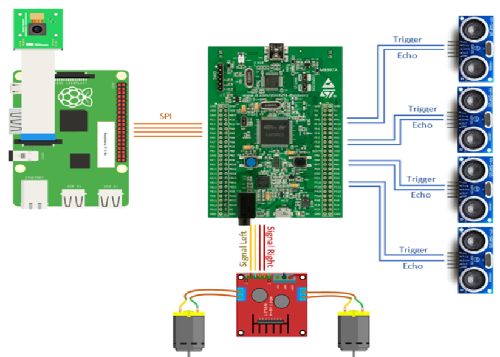
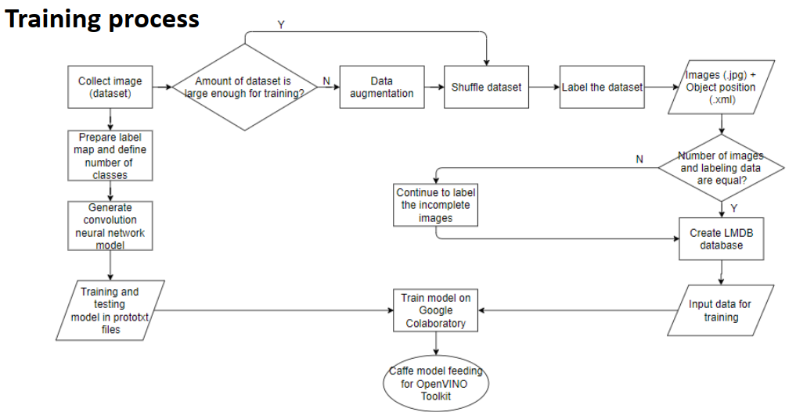
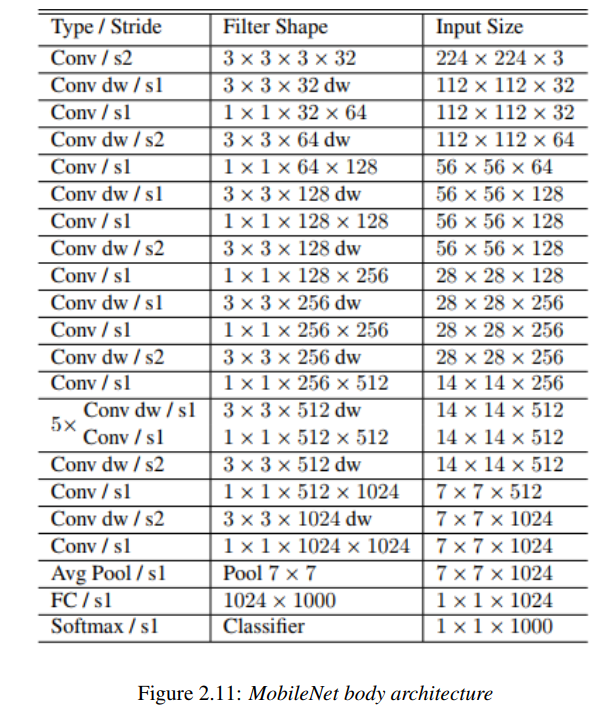
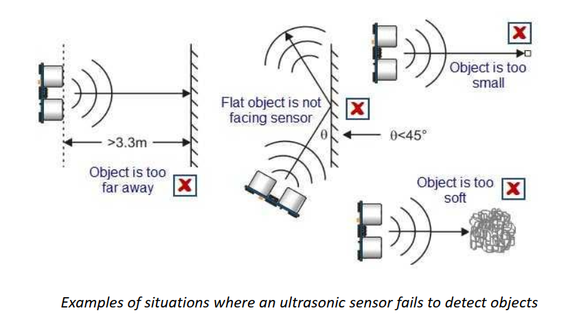
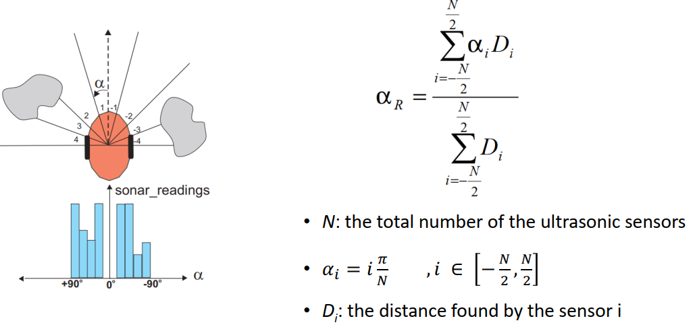

# Smart Suitcase

## 📖 Overview
The **Smart Suitcase** project was developed to provide a hands-free travel experience by enabling autonomous tracking and obstacle avoidance. Through the integration of computer vision, fuzzy control, and embedded systems, the suitcase is capable of following its owner in real-time, avoiding collisions, and preventing loss in crowded environments such as airports. This work was carried out as part of a graduation thesis at **Ho Chi Minh City University of Technology, Faculty of Electrical & Electronics Engineering**, under the supervision of Assoc. Prof. Huynh Thai Hoang.  

---

## 🎯 Objectives
The motivation behind this project was to design a cost-effective smart suitcase that is both user-friendly and technically efficient. Unlike many commercial products, the prototype emphasizes affordability while still achieving real-time tracking and autonomous navigation. The system relies on the Intel Movidius Neural Compute Stick for owner detection, an ARM-based controller for motor control, and an Android application with a web interface for seamless user interaction. The ultimate goal was to deliver a practical, low-cost solution that surpasses the limitations of existing smart luggage on the market.  

  

---

## ⚙️ Methodology
The methodology combines both hardware and software design into a unified system. On the software side, a deep learning model was trained to perform logo-based object detection, enabling the suitcase to identify and track its owner. This detection process was enhanced with a fuzzy logic controller, which refined the tracking response and improved obstacle avoidance. On the hardware side, an ARM-based controller was responsible for driving the motors and handling communication with peripheral sensors. Ultrasonic sensors were integrated for real-time distance measurement, while Node.js-based server processes ensured smooth data transfer through TCP/IP and SPI protocols. To support user interaction, a mobile Android application was built to notify the owner in case of lost tracking, complemented by a web interface for non-Android users.  

  
  
  

---

## 📊 Results and Analysis
The system demonstrated reliable real-time tracking under different conditions, including rotation, varying distances, and partial occlusion of the target logo. The fuzzy controller proved effective in adapting to these challenges by adjusting the control signals dynamically, thereby improving accuracy. Obstacle avoidance tests showed that the suitcase could handle one or more obstacles, as well as situations where the path was directly blocked. Finally, the integration of the server and Android application provided an effective anti-loss mechanism, alerting the user when the suitcase lost its target and offering the flexibility to switch easily between automatic and manual control.  

  
  
  

---

## 🤖 Deep Learning and Intel Movidius Acceleration
At the heart of the Smart Suitcase’s autonomous tracking system is a deep learning–based object detection pipeline. We implemented the **MobileNet-SSD (Single Shot MultiBox Detector)** architecture, chosen for its excellent trade-off between accuracy and efficiency on embedded platforms.  

**MobileNet** provides the backbone network, using **depthwise separable convolutions** to drastically reduce the number of parameters while maintaining competitive performance. **SSD (Single Shot Detector)** then enables fast multi-object detection in a single forward pass, making it well suited for real-time applications. The combined **MobileNet-SSD** framework is therefore lightweight, fast, and accurate — a critical requirement for running on mobile hardware.  

To overcome the limitations of the Raspberry Pi in handling deep learning workloads, we integrated the **Intel Movidius Neural Compute Stick 2 (NCS2)**. This device contains a dedicated **Vision Processing Unit (VPU)** optimized for convolutional neural networks, enabling the suitcase to achieve real-time inference while keeping power consumption low. The Raspberry Pi focuses on system integration tasks such as motor control, sensor communication, and server interaction, while the Movidius offloads the heavy computation of the MobileNet-SSD model.  

The deep learning model was trained using Google Colab with transfer learning and then deployed on the Raspberry Pi with NCS2 acceleration. This combination allowed the suitcase to track its owner in real time under challenging conditions, including rotation, partial occlusion, and varying distances. It demonstrates how modern embedded AI accelerators can bring advanced computer vision into practical consumer devices.  

## 📡 Ultrasonic Sensor Control
In addition to vision-based tracking, the smart suitcase relies on ultrasonic sensors to measure distances and avoid collisions. Each sensor operates by emitting an ultrasonic pulse when triggered, then measuring the time taken for the echo to return. From this elapsed time, the system calculates the distance using the relation:

\[
\text{distance (cm)} = \frac{\text{elapsed time} \times 0.0001 \times 340}{2}
\]

This mechanism enables the suitcase to detect nearby obstacles in real time. However, ultrasonic sensors are not always reliable: they can fail to detect objects with irregular surfaces, thin edges, or materials that absorb or scatter sound waves. In these cases, the suitcase might underestimate or completely miss an obstacle.  

To mitigate this issue, the system employs multiple sensors arranged around the suitcase and integrates their readings with a fuzzy logic controller. This redundancy allows the suitcase to make safer navigation decisions even when one or more sensors fail to report accurate data. In future work, the ultrasonic sensing module could be combined with additional sensing modalities, such as infrared or depth cameras, to further enhance robustness.  

This mechanism enables the suitcase to detect nearby obstacles in real time. Although the method is computationally lightweight and effective in many scenarios, ultrasonic sensors can occasionally fail in detecting certain surfaces or angles. To address this limitation, the suitcase integrates multiple sensors and combines their readings with the fuzzy logic controller, ensuring more robust navigation even in crowded environments.  

---

## ✅ Merits and Limitations
The project successfully demonstrated the feasibility of building a smart suitcase that could track its owner in real-time while also offering a server-assisted alarm system to prevent loss. The combination of auto and manual modes gave users greater flexibility, and the integration of fuzzy control improved tracking robustness. However, some limitations were observed. The system struggled in low-light environments due to visual detection constraints, and it required a Wi-Fi connection to update data to the server. Movement speed was slower than expected, and noise sometimes appeared during obstacle detection, affecting overall performance.  

---

## 🚀 Future Work
Several directions for improvement were identified. Hardware optimization and aesthetic enhancement would make the suitcase more appealing for practical use. Integrating a weight sensor could add a built-in luggage scale, while designing a removable battery would increase convenience for travelers. On the algorithmic side, future development could include skeleton-based body tracking to improve owner detection and the ability for the suitcase to follow from the side rather than just from behind. These improvements would bring the product closer to a market-ready solution.  

---

## 👥 Team and Acknowledgment
This project was carried out by **Hoang Trong Dai (1510633)** and **Ly Kim Tien (1513418)**, under the guidance of **Assoc. Prof. Huynh Thai Hoang**. The team is grateful for the continuous support of the Faculty of Electrical & Electronics Engineering at Ho Chi Minh City University of Technology.  

---

## 📅 Date
**06/2019** – Ho Chi Minh City University of Technology, Department of Control Engineering & Automation
